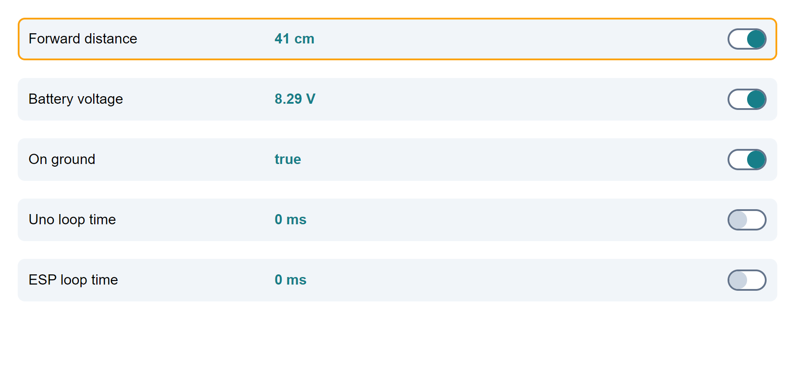

# RobotCarUI

I was gifted an Elegoo Smart robot car v4 and started to experiment by writing some new software to provide a better experience than the one provided out of the box.
This app is the client part of this project.
It works with these 2 other projects that have to be installed on the Uno and ESP32 :

1. The Arduino part : [https://github.com/Thibdumont/RobotCar2](https://github.com/Thibdumont/RobotCar2)
2. The ESP32 part : [https://github.com/Thibdumont/espCam2](https://github.com/Thibdumont/espCam2)

- [RobotCarUI](#robotcarui)
  - [Demo](#demo)
  - [Requirements](#requirements)
  - [Key features](#key-features)
  - [Installation instructions](#installation-instructions)
    - [Configuration](#configuration)
    - [Building the app](#building-the-app)
  - [Using the app](#using-the-app)
    - [LAN mode](#lan-mode)
    - [SoftAP mode](#softap-mode)
    - [Help](#help)
  - [Detailed features](#detailed-features)
    - [Gamepad](#gamepad)
    - [Screens](#screens)
      - [Live stream/control car](#live-streamcontrol-car)
      - [Car settings](#car-settings)
      - [HUD info](#hud-info)
      - [Photo library](#photo-library)
      - [Camera settings](#camera-settings)
    - [Connection](#connection)
    - [Settings persistence](#settings-persistence)
    - [Battery percentage](#battery-percentage)
    - [Wifi level](#wifi-level)
  - [Work in progress](#work-in-progress)
  - [Coming soon](#coming-soon)

## Demo

Quick video demo : [https://youtu.be/IlVKu30kO0o](https://youtu.be/IlVKu30kO0o)

## Requirements

- You need to have a `Elegoo Smart robot car v4` kit or build some equivalent.
- A gamepad (tested with Xbox controller, might work with others..)

## Key features

- Web UI, working on chrome (not tested on other browsers), on mobile/desktop.
- Gamepad support (tested with Xbox controller only) to control the car, vibration support (when boosting or reaching the safe stop distance)
- Automatically connect/reconnect to ESP32 server if connection is lost
- Change some car settings (max speed, head speed, safe stop distance, turn factor, etc)
- Persist the settings made by the user in the ESP32 so they are retrieved at every restart
- Live video stream from ESP32 camera
- Change camera settings (resolution, quality, contrast, saturation, brightness)
- Take and manage photos
- Display some data on HUD (battery, wifi level, voltage, forward distance, is on ground, etc)
- Two modes : LAN or Soft AP
- Safe stop distance : prevent the car from hitting a wall
- Auto speed mode : adapt the max speed to the distance detected in front of the car

## Installation instructions

### Configuration

First, you should edit the config of the app to match your network.
To do so, open the `src/app/services/app.config.service.ts` file and update the IP address commented with `local network` (do not update the other one) with the one you assigned to your ESP32 (you should affect your ESP32 a static IP address in your router config) :

```typescript
 private possibleHostIP: Array<string> = [
    "192.168.1.1", //softAP IP
    "192.168.1.32" //local network
  ];

  ...

  //Battery
  public batteryEmptyThreshold = 7.2; // Battery voltage when battery is considered empty
  public batteryFullThreshold = 8.4; // Battery voltage when battery if fully charged
```

You can also tweak the threshold of the battery to match yours and have a good estimation of the battery level.

You should keep the rest as is, unless you want to tweak the app and know what you are doing..

### Building the app

The app is built using Angular framework. I tried to keep the final bundle size as low as possible, so no assets/images/icons/fancy libraries.

1. Install `VSCode`
2. Have latest version of nodeJS/npm installed
3. Clone this repository and go to the `RobotCarUI` folder
4. Run `npm install` to install Angular and project dependencies
5. Run the app
   - Run `npm start` to locally run the app (it will open a browser tab with the app and connect to the car)
   - Run `npm run prod` to build a bundle, so you can upload it to the ESP32 storage and access it directly by typing the ESP IP address in your browser. To do so, copy every file from `dist/` folder to the `data/` folder of the ESP32 project, then upload these files to the ESP32 ([https://github.com/Thibdumont/espCam2](https://github.com/Thibdumont/espCam2))

## Using the app

The app is a web app, in theory you can use it in any browser. But it was tested on chrome only and I think the gamepad API behaves differently in other browsers so you rather keep Chrome for this. If some people are interested, I might support other browsers in the future.

The app is obviously better used in landscape mode (if you are on a mobile).

### LAN mode

If you are in LAN mode, just enter the IP address you set in the config file (see previous section) in your browser to access the app.

### SoftAP mode

Push the Arduino shield button to switch from LAN/SoftAP mode.

In this mode, enter the `192.168.1.1` address in your browser to access the app.

### Help

Anywhere in the app, you can have some help by pressing the `Start button` of your gamepad.

You could start by pressing the `View button` to go fullscreen.

## Detailed features

### Gamepad

The app should be used with a gamepad. Connect a gamepad on your computer/smartphone and it should work (tested with Xbox controller only).

Press the `Start button` anywhere and you will have the button mapping for each screen.

### Screens

#### Live stream/control car

The app is composed of a central video stream UI that is used to drive the car.
There, you can drive the car using the gamepad. You can take some photos, adjust the max speed, and see some informations on the HUD.


#### Car settings

Opened with the up Dpad.
This panel is for adjusting the car settings : servo speed, safe stop distance, auto speed mode, etc


#### HUD info

Opened with the left Dpad.
This panel is for displaying some live data (radar distance, voltage, debug info etc). There you can toggle on/off the HUD display of this data.


#### Photo library

Opened with the right Dpad.
There you can see photos taken. You can navigate left/right and delete photos. Photos are not stored anywhere, they are lost if you refresh the page.


#### Camera settings

Opened with the down Dpad.
It is used to change the camera settings


### Connection

The app automatically reconnect to the ESP, it cycles between every IP address filled in the config (see Configuration section) so you don't have to refresh when changing network mode (LAN/SoftAP).

### Settings persistence

Any settings you change will be saved on ESP32 storage. So when you restart the car or refresh the page, it will reload the settings you chose previously. Every config change is immediatly persisted in the ESP. Do not power off the robot after changing a setting or you might corrupt the FS. If so, you will have to upload a fresh setting file (see ESP32 readme file).

### Battery percentage

The best solution I found was to compute the battery level only when the robot is idle (when no mechanical parts are in action). I couldn't figure out how to get a better estimation.. if anybody have an idea on how I could do it, do not hesitate.

### Wifi level

Wifi level only works in LAN mode. If you have any idea on how to get it in SoftAP mode, do not hesitate.

## Work in progress

This project is still work in progress. Any suggestion, advice, pull request is welcome.

## Coming soon

1. Battery level estimation improvement
2. More car settings/features
3. Better documentation if people are interested
